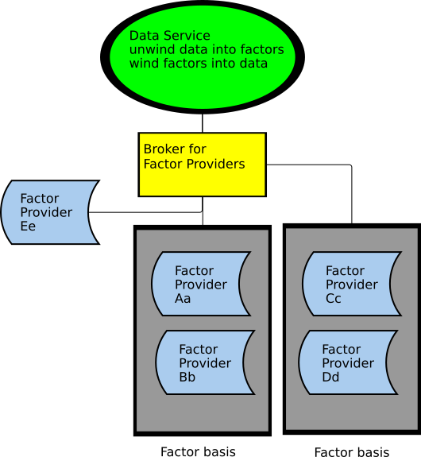

# in-the-wind

## Purpose
Securing Data With Zero Trust

Concerns around data security start with the question of authority; does a person or entity have authority to access data?  
And so, the password was invented, along with cipher keys and tokens.

But no matter how good our passwords and encryption may be, they are no more trustworthy than the person(s) owning them.  
We have what might be called a **single-point of security failure**.

If we have data that we do not want exposed to such risk; perhaps customer data, or trade secrets, what can be done?
This is not a new question.  One answer is to create shared authorization (see literature reference), in which no single person
has authority to access the super-secret data.  

At it's simplest, we might imagine that two passwords, owned by different people, are required
to access our super-sensitive data.  With our two passwords, we've solved the *single-point of security failure* problem.  Things look good for a moment or so
until we ask... what if something happens to one of the people?  Do we lose access to our data?

Considering this scenario, we find that there are two additional problems (besides single-point of security failure) that we need to solve.
1. First, we need to solve what we might call a **single-point of access failure** problem.  That is, we can not have a single person or entity with the 
potential to deny us access to our data.
1. Second, we need to account for the fact that roles change.  People leave positions.  Authority for specific individuals 
may need to be reassigned, perhaps without their cooperation.
   

We leverage **secret sharing**  to show, in a proof of concept, the feasibility of offering secret sharing as a service. 
## Overview
We present a method to secure data such that:
1. No single entity has access to secured data (single-point of security failure).
1. No single entity can block or filter access to secured data (single-point of access failure).
1. Trust can be dynamically granted or revoked (authority reassignment).

At the root of the security mechanism, an algorithm produces interchangeable, distributed encoding factors, each owned by a different entity.  (In this POC, we use a pseudo-one-time-pad to generate interchangeable entities.)
## Usage
In this POC, a text message is "unwound" into several (at least two) encoding factors.  To retrieve the message, all the encoding factors are "wound" (combined).  Without all the factors, the message cannot be retrieved. 
### Example
Say that a hospital wants to secure patient's medical records, in a way that puts zero trust in any one particular data-storage provider.  It works with a data-storage broker who arranges for multiple data-storage providers to each store a single encoding factor.  

One pattern that would protect data privacy and against data tyranny (assuming no collusion between data-providing entities) would entail the creation of two parallel sets of two encoding factors, each managed by a separate data provider, call them **Aa**, **Bb**, **Cc**, **Dd**.
**Aa** and **Bb** each own encoding factors that provide a sufficient basis to retrieve the data.  **Cc** and **Dd** each own independent encoding factors that together form a basis to retrieve the data.
Thus, none of the data-providers has access to the data; and none of the data-providers can hold the data for ransom.

Furthermore, if one of the data-providers was found to be untrustworthy, its encoding factor could be invalidated; and a new entity **Ee** could be brought into the process.

### Functionality
The Winder interface exposes two methods: one of which creates factors from a message; and the other which combines factors - to retrieve the original method.
However, these two methods can be leveraged in multiple ways to achieve some interesting behaviors.
1. A message can be unwound into any number of factors greater than one.
1. Factors can be recombined in any order (This is not implicit in the interface, but the strategy in the POC implementation should apply generally).
1. Compromised factors can be replaced without jeopardizing security.
1. If needed, existing factors can be expanded.  For example, say that a message has been secured with two factors, and a need arises to have a third factor.
1. If needed, existing factors can be reduced.  As in the example above, we can also go from having three factors to having two.
1. If needed, we can have parallel sets of factors, each of which can restore the message.

### Getting started
1. Perhaps the best way to get started is to use a debugger and step through some of the unit tests.

## Potential next steps
1. "True" randomization - The POC leverages default Java randomization; which is not true randomness expected for one-time-pads, and may not be sufficiently strong for some applications
1. Expanded support for more data types.
1. Consider that the "Winder" functionality should belong to the owner of the data; so that no "Winder" service itself becomes a data tyrant.

## Literature
* Shamir, Adi. *How to Share a Secret*, 
Massachusetts Institute of Technology
Communications November 1979 of Volume 22 the ACM Number 11 pp. 612-613
  
* *Random number generation*,  Wikipedia, https://en.wikipedia.org/wiki/Random_number_generation

